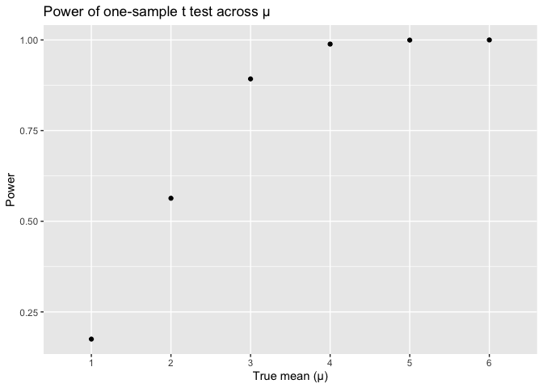
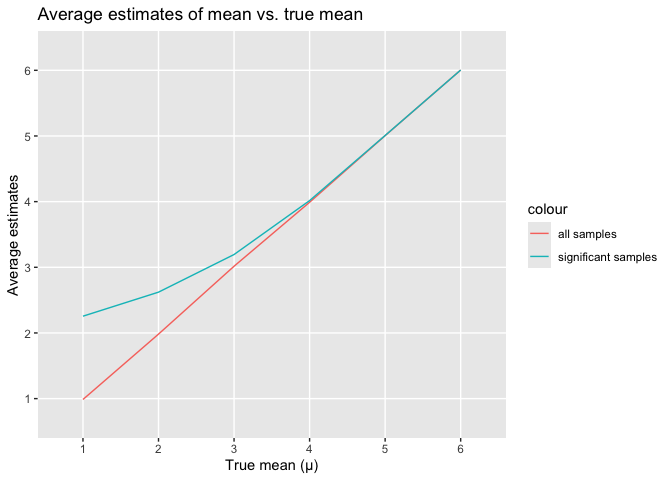

Homework 5
================
Zeqi Li
2024-11-12

# Problem 1

Define a function that identifies whether at least two people in a group
share the same birthday.

``` r
bday_sim = function(n) {
  bday = sample(1:365, 
                 n, 
                 replace = TRUE)
  return(any(duplicated(bday)))
}
```

Run the simulation for 10000 times for group sizes ranged from 2 to 50
using the above function.

``` r
bday_res = tibble(group_size = rep(2:50, 
                                   each = 10000)) |> 
  mutate(result = map_lgl(group_size, 
                          bday_sim))

res_df = bday_res |> 
  group_by(group_size) |> 
  summarize(avg_prob = mean(result))
```

Plotting probability as a function of group size.

``` r
res_df |> 
  ggplot(aes(x = group_size,
             y = avg_prob)) +
  geom_point() + 
  labs(title = "Average probability of shared birthday in a group",
       x = "Group size",
       y = "Average probability")
```

<!-- -->

COMMENT

# Problem 2

Define a function that models drawing data from a normal distribution
and runs a one-sample t test for each dataset.

``` r
t_test_sim = function(n = 30, 
                      mu, 
                      sigma = 5) {
  data = rnorm(n, 
               mean = mu, 
               sd = sigma)
  
  t_res = t.test(data, 
                 mu = 0,
                 alpha = 0.05)
  
  res_df = t_res |> 
    broom::tidy() |> 
    select(mu_hat = estimate,
           p_value = p.value)
  
  return(res_df)
}
```

Test the above function on $\mu = 0$. Obtain 5000 datasets and t test
results by running the above function.

``` r
mu = 0

mu0_res = expand_grid(id = 1:5000) |> 
  mutate(res = map(id, 
                   ~ t_test_sim(mu = 0))) |> 
  unnest(res)
```

Apply the function on different $\mu$s.

``` r
mu = 1:6

mu_res = expand_grid(id = 1:5000,
                     mu = mu) |> 
  mutate(res = map(mu,
                   ~ t_test_sim(mu = .x))) |> 
  unnest(res)
```

Plotting the powers of t test across all $\mu$s.

``` r
power_df = mu_res |> 
  group_by(mu) |> 
  summarize(power = mean(p_value < 0.05))
  
power_df |> ggplot(aes(x = mu,
                       y = power)) +
  geom_point() +
  labs(title = "Power of one-sample t test across µ",
       y = "Power",
       x = "True mean (µ)") +
  scale_x_discrete(limits = factor(mu))
```

<!-- -->

An effect size is defined as the difference between the true value of
mean ($\mu$) and the mean under our null hypothesis, which is 0. As we
set larger and larger values for the true mean, the effect size also
gets larger. From the above plot, we can infer that as the effect size
increases, the power of the test also increases. This is because as
effect size gets larger, it is more deviated from $\mu = 0$ (our null
hypothesis). Therefore, it is more likely to reject the null hypothesis,
making the test more powerful.

``` r
avg_mu_df = mu_res |> 
  group_by(mu) |> 
  summarize(avg_mu_hat = mean(mu_hat),
            sig_avg_mu_hat = mean(mu_hat[p_value < 0.05]))

avg_mu_df |> 
  ggplot(aes(x = mu)) +
  geom_line(aes(y = avg_mu_hat,
                 color = "all samples")) +
  geom_line(aes(y = sig_avg_mu_hat,
                 color = "significant samples")) +
  scale_x_discrete(limits = factor(mu)) +
  scale_y_discrete(limits = factor(1:6)) + 
  labs(title = "Average estimates of mean vs. true mean",
       x = "True mean (µ)",
       y = "Average estimates")
```

<!-- -->

From the red graph, we can see that the averages of $\hat{\mu}$ from all
samples is equal to the true value of $\mu$. However, the blue graph
shows that the sample averages of $\hat{\mu}$ from tests that reject the
null hypothesis are not equal to the value of $\mu$ at the beginning,
but they slowly converge to the value of $\mu$ as effect size increases.
This is because when effect size is small, we need a large enough
$\hat{\mu}$ in order to reject our null hypothesis ($\mu = 0$). When the
effect size is large, however, we don’t need a very distinct $\hat{\mu}$
in order to reject the null. Therefore, we can see that the graph of
average $\hat{\mu}$ from significant samples (p \< 0.05) is higher than
that from all samples at the beginning, but then it approaches the graph
of average $\hat{\mu}$ from all samples and the true mean values.

# Problem 3

Import the data from GitHub

``` r
url = "https://raw.githubusercontent.com/washingtonpost/data-homicides/master/homicide-data.csv"

homocide = read_csv(url(url))

summary_df = summary(homocide)
knitr::kable(summary_df)
```

|     | uid              | reported_date     | victim_last      | victim_first     | victim_race      | victim_age       | victim_sex       | city             | state            | lat           | lon             | disposition      |
|:----|:-----------------|:------------------|:-----------------|:-----------------|:-----------------|:-----------------|:-----------------|:-----------------|:-----------------|:--------------|:----------------|:-----------------|
|     | Length:52179     | Min. : 20070101   | Length:52179     | Length:52179     | Length:52179     | Length:52179     | Length:52179     | Length:52179     | Length:52179     | Min. :25.73   | Min. :-122.51   | Length:52179     |
|     | Class :character | 1st Qu.: 20100318 | Class :character | Class :character | Class :character | Class :character | Class :character | Class :character | Class :character | 1st Qu.:33.77 | 1st Qu.: -96.00 | Class :character |
|     | Mode :character  | Median : 20121216 | Mode :character  | Mode :character  | Mode :character  | Mode :character  | Mode :character  | Mode :character  | Mode :character  | Median :38.52 | Median : -87.71 | Mode :character  |
|     | NA               | Mean : 20130899   | NA               | NA               | NA               | NA               | NA               | NA               | NA               | Mean :37.03   | Mean : -91.47   | NA               |
|     | NA               | 3rd Qu.: 20150911 | NA               | NA               | NA               | NA               | NA               | NA               | NA               | 3rd Qu.:40.03 | 3rd Qu.: -81.76 | NA               |
|     | NA               | Max. :201511105   | NA               | NA               | NA               | NA               | NA               | NA               | NA               | Max. :45.05   | Max. : -71.01   | NA               |
|     | NA               | NA                | NA               | NA               | NA               | NA               | NA               | NA               | NA               | NA’s :60      | NA’s :60        | NA               |
