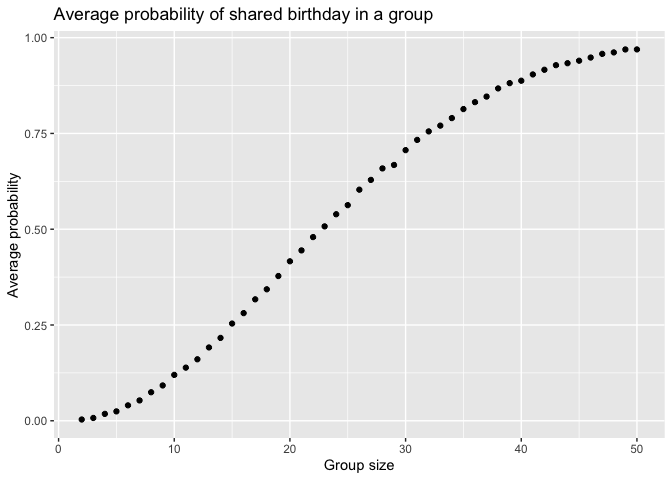

Homework 5
================
Zeqi Li
2024-11-12

# Problem 1

Define a function that identifies whether at least two people in a group
share the same birthday.

``` r
bday_sim = function(n) {
  bday = sample(1:365, 
                 n, 
                 replace = TRUE)
  return(any(duplicated(bday)))
}
```

Run the simulation for 10000 times for group sizes ranged from 2 to 50
using the above function.

``` r
bday_res = tibble(group_size = rep(2:50, 
                                   each = 10000)) |> 
  mutate(result = map_lgl(group_size, 
                          bday_sim))

res_df = bday_res |> 
  group_by(group_size) |> 
  summarize(avg_prob = mean(result))
```

Plotting probability as a function of group size.

``` r
res_df |> 
  ggplot(aes(x = group_size,
             y = avg_prob)) +
  geom_point() + 
  labs(title = "Average probability of shared birthday in a group",
       x = "Group size",
       y = "Average probability")
```

<!-- --> COMMENT

# Problem 2
