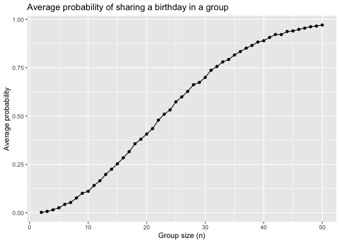
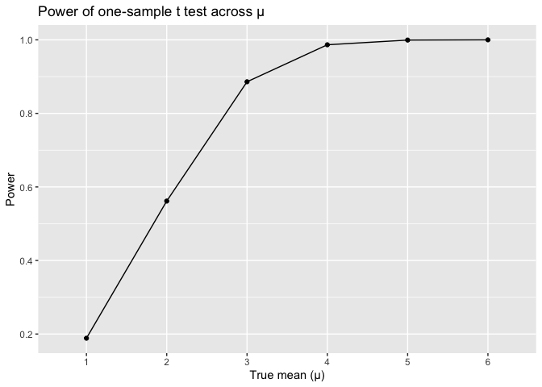
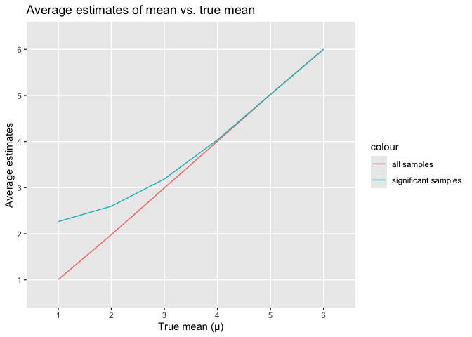

Homework 5
================
Zeqi Li
2024-11-12

# Problem 1

## Define function

Define a function that identifies whether at least two people in a group
share the same birthday.

``` r
bday_sim = function(n) {
  bday = sample(1:365, 
                 n, 
                 replace = TRUE)
  return(any(duplicated(bday)))
}
```

## Run simulations

Run the simulation for 10000 times for group sizes ranged from 2 to 50
using the above function.

``` r
bday_res = tibble(group_size = rep(2:50, 
                                   each = 10000)) |> 
  mutate(result = map_lgl(group_size, 
                          bday_sim))

res_df = bday_res |> 
  group_by(group_size) |> 
  summarize(avg_prob = mean(result))
```

## Visualization

Plot probability as a function of group size.

``` r
res_df |> 
  ggplot(aes(x = group_size,
             y = avg_prob)) +
  geom_point() + 
  geom_line() +
  labs(title = "Average probability of sharing a birthday in a group",
       x = "Group size (n)",
       y = "Average probability")
```

<!-- -->

From the above plot, we can see that the as group size increases, the
average probability of shared birthdays in the group also increases, and
the increase almost follows a logistic behavior.

This indicates that in smaller group sizes (n \< ~10), the probability
of at least two people sharing a birthday grows slowly. But once the
group size gets large enough, as shown on the graph from n = 10 to n =
30, the probability grows very fast, meaning that in these large groups,
it is very likely for two people to have the same birthday.

In particular, the probability exceeds 0.50 at n = 23 in our simulation,
which actually aligns with the famous “birthday paradox”—in a group of
just 23 people, there’s more than 50% chance that at least two people
will share the same birthday.

When n gets closer to 50, we can see that the probabilities are close to
1, which means that for a large group with around 50 people, it is
almost certain that at least two people will share their birthday.

# Problem 2

## Define function

Define a function that models drawing data from a normal distribution
and runs a one-sample t test for each dataset.

``` r
t_test_sim = function(n = 30, 
                      mu, 
                      sigma = 5) {
  data = rnorm(n, 
               mean = mu, 
               sd = sigma)
  
  t_res = t.test(data, 
                 mu = 0,
                 alpha = 0.05)
  
  res_df = t_res |> 
    broom::tidy() |> 
    select(mu_hat = estimate,
           p_value = p.value)
  
  return(res_df)
}
```

## µ = 0

Test the above function on $\mu = 0$. Obtain 5000 datasets and t test
results by running the above function.

``` r
mu = 0

mu0_res = expand_grid(id = 1:5000) |> 
  mutate(res = map(id, 
                   ~ t_test_sim(mu = 0))) |> 
  unnest(res)

mu0_res
```

    ## # A tibble: 5,000 × 3
    ##       id  mu_hat p_value
    ##    <int>   <dbl>   <dbl>
    ##  1     1  1.11    0.283 
    ##  2     2 -0.939   0.236 
    ##  3     3 -0.0423  0.959 
    ##  4     4 -1.59    0.101 
    ##  5     5  1.75    0.0482
    ##  6     6 -0.150   0.857 
    ##  7     7 -0.222   0.843 
    ##  8     8 -0.179   0.822 
    ##  9     9 -0.344   0.652 
    ## 10    10  0.464   0.548 
    ## # ℹ 4,990 more rows

## Other µ values

Apply the function on different $\mu$s.

``` r
mu = 1:6

mu_res = expand_grid(id = 1:5000,
                     mu = mu) |> 
  mutate(res = map(mu,
                   ~ t_test_sim(mu = .x))) |> 
  unnest(res)
```

## Visualization

### Plot the powers of t test across all µs.

``` r
power_df = mu_res |> 
  group_by(mu) |> 
  summarize(power = mean(p_value < 0.05))
  
power_df |> ggplot(aes(x = mu,
                       y = power)) +
  geom_point() +
  geom_line() + 
  labs(title = "Power of one-sample t test across µ",
       y = "Power",
       x = "True mean (µ)") +
  scale_x_discrete(limits = factor(mu))
```

<!-- -->

An effect size is defined as the difference between the true value of
mean ($\mu$) and the mean under our null hypothesis, which is 0. As we
set larger and larger values for the true mean, the effect size also
gets larger. From the above plot, we can infer that as the effect size
increases, the power of the test also increases. This is because as
effect size gets larger, it is more deviated from $\mu = 0$ (our null
hypothesis). Therefore, it is more likely to reject the null hypothesis,
making the test more powerful.

### Plot the average sample estimate of µ for all µs

``` r
avg_mu_df = mu_res |> 
  group_by(mu) |> 
  summarize(avg_mu_hat = mean(mu_hat),
            sig_avg_mu_hat = mean(mu_hat[p_value < 0.05]))

avg_mu_df |> 
  ggplot(aes(x = mu)) +
  geom_line(aes(y = avg_mu_hat,
                 color = "all samples")) +
  geom_line(aes(y = sig_avg_mu_hat,
                 color = "significant samples")) +
  scale_x_discrete(limits = factor(mu)) +
  scale_y_discrete(limits = factor(1:6)) + 
  labs(title = "Average estimates of mean vs. true mean",
       x = "True mean (µ)",
       y = "Average estimates")
```

<!-- -->

From the red graph, we can see that the averages of $\hat{\mu}$ from all
samples is equal to the true value of $\mu$. However, the blue graph
shows that the sample averages of $\hat{\mu}$ from tests that reject the
null hypothesis are not equal to the value of $\mu$ at the beginning,
but they slowly converge to the value of $\mu$ as effect size increases.
This is because when effect size is small, we need a large enough
$\hat{\mu}$ in order to reject our null hypothesis ($\mu = 0$). When the
effect size is large, however, we don’t need a very distinct $\hat{\mu}$
in order to reject the null. Therefore, we can see that the graph of
average $\hat{\mu}$ from significant samples (p \< 0.05) is higher than
that from all samples at the beginning, but then it approaches the graph
of average $\hat{\mu}$ from all samples and the true mean values.

# Problem 3

## Import data from GitHub

``` r
url = "https://raw.githubusercontent.com/washingtonpost/data-homicides/master/homicide-data.csv"

homicide = read_csv(url(url),
                    na = c("", "Unknown"))

summary(homicide)
```

    ##      uid            reported_date       victim_last        victim_first      
    ##  Length:52179       Min.   : 20070101   Length:52179       Length:52179      
    ##  Class :character   1st Qu.: 20100318   Class :character   Class :character  
    ##  Mode  :character   Median : 20121216   Mode  :character   Mode  :character  
    ##                     Mean   : 20130899                                        
    ##                     3rd Qu.: 20150911                                        
    ##                     Max.   :201511105                                        
    ##                                                                              
    ##  victim_race          victim_age     victim_sex            city          
    ##  Length:52179       Min.   :  0.0   Length:52179       Length:52179      
    ##  Class :character   1st Qu.: 22.0   Class :character   Class :character  
    ##  Mode  :character   Median : 28.0   Mode  :character   Mode  :character  
    ##                     Mean   : 31.8                                        
    ##                     3rd Qu.: 40.0                                        
    ##                     Max.   :102.0                                        
    ##                     NA's   :2999                                         
    ##     state                lat             lon          disposition       
    ##  Length:52179       Min.   :25.73   Min.   :-122.51   Length:52179      
    ##  Class :character   1st Qu.:33.77   1st Qu.: -96.00   Class :character  
    ##  Mode  :character   Median :38.52   Median : -87.71   Mode  :character  
    ##                     Mean   :37.03   Mean   : -91.47                     
    ##                     3rd Qu.:40.03   3rd Qu.: -81.76                     
    ##                     Max.   :45.05   Max.   : -71.01                     
    ##                     NA's   :60      NA's   :60

The raw `homicide` dataset contains data of criminal homicide cases over
the past decade in 50 cities in the US, as collected by The Washington
Post. It uses 12 variables (uid, reported_date, victim_last,
victim_first, victim_race, victim_age, victim_sex, city, state, lat,
lon, disposition) to describe the 5.2178^{4} observations.

## Tidy up the `homicide` dataset

Create a `city_state` variable.

``` r
homicide_tidy = homicide |> 
  mutate(city_state = paste(city, 
                            state, 
                            sep = ", ")) |> 
  select(-city & -state)
```

Obtain summary data frame that has the total number of homicides and
unsolved homicides across cities.

``` r
city_sum = homicide_tidy |> 
  group_by(city_state) |> 
  summarize(total_homicide = n(),
            unsolved_homicide = sum(disposition %in% c("Closed without arrest",
                                                       "Open/No arrest")))

knitr::kable(city_sum,
             caption = "Estimated proportion and confidence interval in all 50 cities",
             col.names = c("City, state",
                           "Total homicides",
                           "Unsolved homicides"))
```

| City, state        | Total homicides | Unsolved homicides |
|:-------------------|----------------:|-------------------:|
| Albuquerque, NM    |             378 |                146 |
| Atlanta, GA        |             973 |                373 |
| Baltimore, MD      |            2827 |               1825 |
| Baton Rouge, LA    |             424 |                196 |
| Birmingham, AL     |             800 |                347 |
| Boston, MA         |             614 |                310 |
| Buffalo, NY        |             521 |                319 |
| Charlotte, NC      |             687 |                206 |
| Chicago, IL        |            5535 |               4073 |
| Cincinnati, OH     |             694 |                309 |
| Columbus, OH       |            1084 |                575 |
| Dallas, TX         |            1567 |                754 |
| Denver, CO         |             312 |                169 |
| Detroit, MI        |            2519 |               1482 |
| Durham, NC         |             276 |                101 |
| Fort Worth, TX     |             549 |                255 |
| Fresno, CA         |             487 |                169 |
| Houston, TX        |            2942 |               1493 |
| Indianapolis, IN   |            1322 |                594 |
| Jacksonville, FL   |            1168 |                597 |
| Kansas City, MO    |            1190 |                486 |
| Las Vegas, NV      |            1381 |                572 |
| Long Beach, CA     |             378 |                156 |
| Los Angeles, CA    |            2257 |               1106 |
| Louisville, KY     |             576 |                261 |
| Memphis, TN        |            1514 |                483 |
| Miami, FL          |             744 |                450 |
| Milwaukee, wI      |            1115 |                403 |
| Minneapolis, MN    |             366 |                187 |
| Nashville, TN      |             767 |                278 |
| New Orleans, LA    |            1434 |                930 |
| New York, NY       |             627 |                243 |
| Oakland, CA        |             947 |                508 |
| Oklahoma City, OK  |             672 |                326 |
| Omaha, NE          |             409 |                169 |
| Philadelphia, PA   |            3037 |               1360 |
| Phoenix, AZ        |             914 |                504 |
| Pittsburgh, PA     |             631 |                337 |
| Richmond, VA       |             429 |                113 |
| Sacramento, CA     |             376 |                139 |
| San Antonio, TX    |             833 |                357 |
| San Bernardino, CA |             275 |                170 |
| San Diego, CA      |             461 |                175 |
| San Francisco, CA  |             663 |                336 |
| Savannah, GA       |             246 |                115 |
| St. Louis, MO      |            1677 |                905 |
| Stockton, CA       |             444 |                266 |
| Tampa, FL          |             208 |                 95 |
| Tulsa, AL          |               1 |                  0 |
| Tulsa, OK          |             583 |                193 |
| Washington, DC     |            1345 |                589 |

Estimated proportion and confidence interval in all 50 cities

## Proportion of unsolved homicides in Baltimore

Estimate the proportion and save the output.

``` r
baltimore_sum = homicide_tidy |> 
  filter(city_state == "Baltimore, MD") |> 
  summarize(total_homicide = n(),
            unsolved_homicide = sum(disposition %in% c("Closed without arrest",
                                                       "Open/No arrest")))

prop_test_res = prop.test(pull(baltimore_sum, unsolved_homicide),
                          pull(baltimore_sum, total_homicide)) |> 
  broom::tidy() |> 
  select(estimate, 
         conf.low,
         conf.high) |> 
  mutate(conf_int = paste(round(conf.low, 3),
                          round(conf.high, 3),
                          sep = ", "))
```

The estimated proportion of unsolved homicides in Baltimore, MD is
0.6455607 and the confidence interval is (0.628, 0.663).

## Proportion of unsolved homicides in all 50 cities

``` r
city_sum = homicide_tidy |> 
  group_by(city_state) |> 
  summarize(total_homicide = n(),
            unsolved_homicide = sum(disposition %in% c("Closed without arrest",
                                                       "Open/No arrest")))

all_prop_test_res = city_sum |> 
  mutate(output = map2(unsolved_homicide, total_homicide, ~ prop.test(.x, .y)),
         result = map(output, broom::tidy)) |> 
  unnest(result) |> 
  select(city_state,
         estimate,
         conf.low,
         conf.high) |> 
  mutate(conf_int = paste(round(conf.low, 3),
                          round(conf.high, 3),
                          sep = ", "))

all_prop_test_res |> 
  select(-conf.low & -conf.high) |> 
  knitr::kable(digits = 3,
               col.names = c("City, state",
                           "Estimated proportion", 
                           "Confidence interval"),
               caption = "Estimated proportion and confidence interval for unsolved homicides in 50 cities")
```

| City, state        | Estimated proportion | Confidence interval |
|:-------------------|---------------------:|:--------------------|
| Albuquerque, NM    |                0.386 | 0.337, 0.438        |
| Atlanta, GA        |                0.383 | 0.353, 0.415        |
| Baltimore, MD      |                0.646 | 0.628, 0.663        |
| Baton Rouge, LA    |                0.462 | 0.414, 0.511        |
| Birmingham, AL     |                0.434 | 0.399, 0.469        |
| Boston, MA         |                0.505 | 0.465, 0.545        |
| Buffalo, NY        |                0.612 | 0.569, 0.654        |
| Charlotte, NC      |                0.300 | 0.266, 0.336        |
| Chicago, IL        |                0.736 | 0.724, 0.747        |
| Cincinnati, OH     |                0.445 | 0.408, 0.483        |
| Columbus, OH       |                0.530 | 0.5, 0.56           |
| Dallas, TX         |                0.481 | 0.456, 0.506        |
| Denver, CO         |                0.542 | 0.485, 0.598        |
| Detroit, MI        |                0.588 | 0.569, 0.608        |
| Durham, NC         |                0.366 | 0.31, 0.426         |
| Fort Worth, TX     |                0.464 | 0.422, 0.507        |
| Fresno, CA         |                0.347 | 0.305, 0.391        |
| Houston, TX        |                0.507 | 0.489, 0.526        |
| Indianapolis, IN   |                0.449 | 0.422, 0.477        |
| Jacksonville, FL   |                0.511 | 0.482, 0.54         |
| Kansas City, MO    |                0.408 | 0.38, 0.437         |
| Las Vegas, NV      |                0.414 | 0.388, 0.441        |
| Long Beach, CA     |                0.413 | 0.363, 0.464        |
| Los Angeles, CA    |                0.490 | 0.469, 0.511        |
| Louisville, KY     |                0.453 | 0.412, 0.495        |
| Memphis, TN        |                0.319 | 0.296, 0.343        |
| Miami, FL          |                0.605 | 0.569, 0.64         |
| Milwaukee, wI      |                0.361 | 0.333, 0.391        |
| Minneapolis, MN    |                0.511 | 0.459, 0.563        |
| Nashville, TN      |                0.362 | 0.329, 0.398        |
| New Orleans, LA    |                0.649 | 0.623, 0.673        |
| New York, NY       |                0.388 | 0.349, 0.427        |
| Oakland, CA        |                0.536 | 0.504, 0.569        |
| Oklahoma City, OK  |                0.485 | 0.447, 0.524        |
| Omaha, NE          |                0.413 | 0.365, 0.463        |
| Philadelphia, PA   |                0.448 | 0.43, 0.466         |
| Phoenix, AZ        |                0.551 | 0.518, 0.584        |
| Pittsburgh, PA     |                0.534 | 0.494, 0.573        |
| Richmond, VA       |                0.263 | 0.223, 0.308        |
| Sacramento, CA     |                0.370 | 0.321, 0.421        |
| San Antonio, TX    |                0.429 | 0.395, 0.463        |
| San Bernardino, CA |                0.618 | 0.558, 0.675        |
| San Diego, CA      |                0.380 | 0.335, 0.426        |
| San Francisco, CA  |                0.507 | 0.468, 0.545        |
| Savannah, GA       |                0.467 | 0.404, 0.532        |
| St. Louis, MO      |                0.540 | 0.515, 0.564        |
| Stockton, CA       |                0.599 | 0.552, 0.645        |
| Tampa, FL          |                0.457 | 0.388, 0.527        |
| Tulsa, AL          |                0.000 | 0, 0.945            |
| Tulsa, OK          |                0.331 | 0.293, 0.371        |
| Washington, DC     |                0.438 | 0.411, 0.465        |

Estimated proportion and confidence interval for unsolved homicides in
50 cities

## Visualization

Plot the estimated proportion and confidence interval for each city.

``` r
all_prop_test_res |> 
  ggplot(aes(x = reorder(city_state, estimate),
             y = estimate)) + 
  geom_point() +
  geom_errorbar(aes(ymin = conf.low,
                    ymax = conf.high),
                width = 0.3) +
  theme(axis.text.x = element_text(angle = 90,
                                   vjust = 0.5,
                                   hjust = 1)) +
  labs(title = "Estimated proportion and confidence interval for all cities",
       x = "City",
       y = "Estimated proportion")
```

<!-- -->
